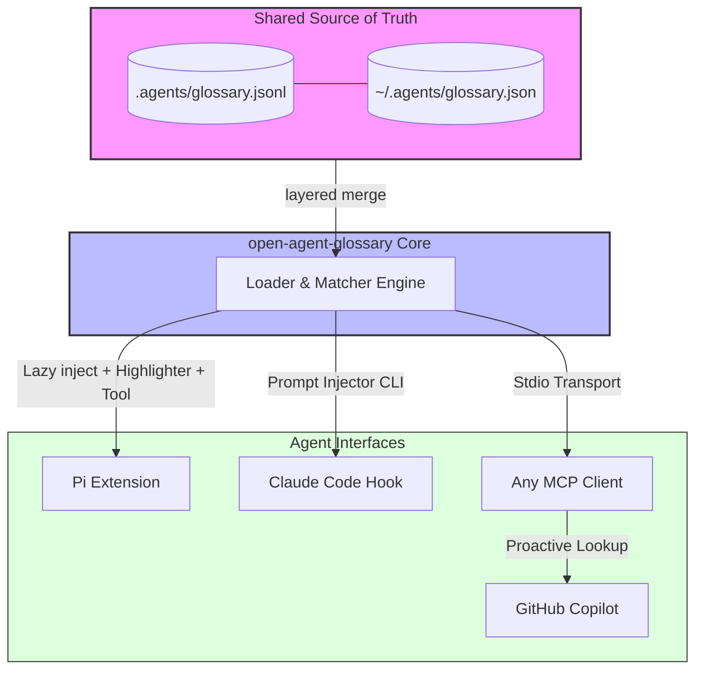

# open-agent-glossary

Tool-agnostic glossary management for coding agents.

Define domain terms once in a `glossary.json` or `glossary.jsonl` file and use them from:

- **Pi** via extension — lazy-loads definitions into the system prompt when terms are mentioned
- **Claude Code** via hooks — injects matching definitions on every prompt
- **Any MCP-capable agent** via stdio MCP server — explicit lookup, add, edit, remove tools
- **CLI scripts** directly

The goal is **fast setup** and **one shared source of truth** across every tool your team uses.



---

## Background

This project is built on top of the schema and concepts from [pi-glossary](https://github.com/ruliana/pi-glossary) by [@ruliana](https://github.com/ruliana) — an excellent Pi extension for glossary injection.

The goal here is to take the same idea further and make it **tool-agnostic**: one shared glossary file that works seamlessly across Pi, Claude Code, GitHub Copilot, and any MCP-capable agent. Your team maintains a single `.agents/glossary.jsonl` in the repo, and every agent — regardless of which tool a developer uses — picks it up automatically.

Existing `glossary.json` files from `pi-glossary` are **100% schema-compatible** and can be dropped in without changes.

---

## Why this package exists

Project acronyms and domain language drift fast. Agents either guess, ask again, or use the wrong meaning. `open-agent-glossary` fixes that by loading glossary terms from local files and making them available to agents automatically or on demand, without bloating every turn's prompt.

**Definitions are only injected when the current prompt references a matching glossary handle.**

---

## Install

```bash
npm install -g open-agent-glossary
# or use directly with
npx open-agent-glossary --help
```

---

## 60-second setup

### 1) Create a project glossary

Put one of these in your repo:

- `.agents/glossary.json` / `.agents/glossary.jsonl` ← recommended (tool-agnostic)
- `.pi/glossary.json` / `.pi/glossary.jsonl` ← Pi-only

Example:

```json
[
  {
    "term": "BFF",
    "definition": "Backend For Frontend — a dedicated backend service tailored to a specific frontend application.",
    "aliases": ["backend for frontend", "bff-pattern"]
  },
  {
    "term": "DRY",
    "definition": "Don't Repeat Yourself — reduce repetition of information across a codebase.",
    "aliases": ["dont repeat yourself"]
  }
]
```

Or JSONL (preferred for team repos — easier diffs, fewer merge conflicts):

```jsonl
{"term":"BFF","definition":"Backend For Frontend — a dedicated backend service tailored to a specific frontend application.","aliases":["backend for frontend"]}
{"term":"DRY","definition":"Don't Repeat Yourself — reduce repetition of information across a codebase.","aliases":["dont repeat yourself"]}
```

### 2) Pick your integration

#### Pi

```bash
pi install npm:open-agent-glossary
```

#### Claude Code hook

Add to `.claude/settings.json`:

```json
{
  "hooks": {
    "UserPrompt": [
      {
        "matcher": ".*",
        "command": "npx open-agent-glossary inject --prompt \"$USER_PROMPT\" --cwd \"$CWD\""
      }
    ]
  }
}
```

#### MCP (GitHub Copilot, Cursor, any MCP client)

Add to your MCP config:

```json
{
  "mcpServers": {
    "glossary": {
      "command": "npx",
      "args": ["open-agent-glossary", "mcp-serve"]
    }
  }
}
```

That is enough to start.

---

## Pi — Extension Details

Pi offers the closest to a native glossary experience because it runs as a **Pi Extension** bundled inside this package.

### Install

```bash
pi install npm:open-agent-glossary
```

### How It Works

1. On session start, the extension loads `~/.agents/glossary.json(.l)`, `~/.pi/agent/glossary.json(.l)`, `.agents/glossary.json(.l)`, and `.pi/glossary.json(.l)` from the current project.
2. Project entries override global entries when they share the same `term`.
3. Before each agent turn, the extension scans the user's prompt for matching glossary terms, aliases, or explicit regex patterns.
4. If terms match, **only terms not already loaded in the current session** are injected into the system prompt.
5. Loaded glossary handles stay visible in the footer status for the rest of the session as `Glossary: term, term`.

### What You Get

- Automatic lazy injection — definitions only appear when the prompt references a matching handle
- Term highlighting while typing
- Footer status showing loaded glossary handles
- `glossary_lookup` tool the LLM can call explicitly
- `/glossary` — show glossary load status
- `/glossary reload` — reload glossary files without restarting Pi

### When Glossary Files Change

Pi keeps glossary entries in memory for the session. Run `/glossary reload` after editing, or start a new session.

---

## Claude Code Hooks

On every prompt:
1. Glossary files are loaded from disk.
2. Terms are matched against the prompt.
3. Matching definitions are returned to the agent as context.

Changes to shared project glossaries are picked up automatically on the **next prompt** — no reload needed.

---

## MCP

Use MCP when your agent supports MCP but not prompt hooks, or when you want explicit tools for lookup/edit/list.

### Tools

| Tool | Description |
|---|---|
| `glossary_lookup` | Look up a term |
| `glossary_list` | List all terms |
| `glossary_add` | Add an entry |
| `glossary_edit` | Edit an entry |
| `glossary_remove` | Remove an entry |

The MCP server re-reads glossary files on every tool call — no reload needed.

---

## GitHub Copilot

Add to `.vscode/mcp.json`:

```json
{
  "servers": {
    "glossary": {
      "command": "npx",
      "args": ["open-agent-glossary", "mcp-serve"]
    }
  }
}
```

Add `.github/copilot-instructions.md` to make Copilot use it proactively:

```markdown
## Glossary

This project uses a shared glossary for domain-specific terms.
When the user mentions an unfamiliar project term or acronym,
use the `glossary_lookup` tool to get its authoritative definition.
At the start of a conversation, use `glossary_list` to see all available terms.
```

See `hooks/github-copilot.md` for full hook and CLI setup.

---

## Shared Project Glossaries

This is a first-class use case. Put the team glossary at:

```text
.agents/glossary.jsonl
```

Why `.jsonl` for shared files?
- Easier line-based diffs
- Fewer merge conflicts when multiple people add entries
- Easy to append entries
- Works with every integration (not just Pi)

### Reload Behavior by Integration

| Integration | Reload behavior |
|---|---|
| Pi | Loaded at session start; `/glossary reload` after changes |
| Claude hook | Re-read on every prompt |
| MCP | Re-read on every tool call |
| CLI | Re-read on every command |

### Merge Order (later wins on same `term`)

1. `~/.pi/agent/glossary.json(.l)` — global Pi terms
2. `~/.agents/glossary.json(.l)` — global cross-tool terms
3. `.pi/glossary.json(.l)` — project Pi terms
4. `.agents/glossary.json(.l)` — project cross-tool terms ← recommended

---

## Glossary Entry Format

```json
{
  "term": "BFF",
  "definition": "Backend For Frontend ...",
  "aliases": ["backend for frontend"],
  "pattern": "BFF|backend.?for.?frontend",
  "flags": "iu",
  "enabled": true,
  "source": "project-glossary"
}
```

| Field | Required | Description |
|---|---|---|
| `term` | yes | canonical handle |
| `definition` | yes | authoritative definition |
| `aliases` | no | extra plain-text triggers |
| `pattern` | no | explicit regex — overrides default matcher |
| `flags` | no | regex flags, default `iu` |
| `enabled` | no | set `false` to disable |
| `source` | no | provenance label |

---

## CLI Quick Reference

```bash
open-agent-glossary inject --prompt "what is BFF" --cwd .
open-agent-glossary lookup BFF --cwd .
open-agent-glossary list --cwd .
open-agent-glossary add "BFF" "Backend For Frontend" --scope project --cwd .
open-agent-glossary edit BFF --definition "Updated definition" --scope project --cwd .
open-agent-glossary remove BFF --scope project --cwd .
open-agent-glossary reset-session
open-agent-glossary mcp-serve
open-agent-glossary mcp-serve --ui --port 7337 --open
open-agent-glossary ui --port 7337       # local web UI only
```

---

## Local UI

A local web UI (Vite + React) gives you a dashboard, an entries manager, and
usage charts — all served by a lightweight [hono](https://hono.dev) control
server embedded in the core package. The server binds to **`127.0.0.1` only**
and never transmits data anywhere.

```bash
# Start the UI (downloads the prebuilt UI package on demand if needed)
open-agent-glossary ui

# Or run the UI alongside the MCP server for an agent session
open-agent-glossary mcp-serve --ui --open
```

Then open http://127.0.0.1:7337.

- **Dashboard** — glossaries discovered on this computer (global + per-project),
  total entries, and global/session lookup + injection counts.
- **Entries** — searchable table with scope tabs (merged / global / project),
  inline add/edit/delete, and smart suggestions (scope, aliases, format) when
  adding a term.
- **Usage** — bar charts of top terms by lookups and injections, toggleable
  between global totals and the current session.

The UI is shipped as a separate **prebuilt** package
(`open-agent-glossary-ui`) via `optionalDependencies` — nothing is compiled on
your machine. If it is not installed, the control server still serves the JSON
API under `/api` and shows an install hint at `/`.

Enable autostart so the UI boots with every agent session:

```json
{
  "ui": { "autostart": true, "port": 7337, "open": true }
}
```

### Global storage

Per-user state lives under `~/.open-agent-glossary/`:

| File | Purpose |
|---|---|
| `usages.json` | Usage tracking (per-term / per-session / global totals) |
| `projects.json` | Registry of project roots seen by the tool (powers discovery) |

The registry grows organically — every time the control server starts in a repo,
that root is recorded so the "glossaries on this computer" view stays current.
No full-disk scanning is ever performed.

---

## Config

Optional config file locations:

- `.agents/open-agent-glossary/config.json`
- `~/.pi/open-agent-glossary/config.json`
- `~/.config/open-agent-glossary/config.json`

```json
{
  "sessionTtlMinutes": 30,
  "ui": {
    "autostart": false,
    "port": 7337,
    "open": true
  }
}
```

---

## Compatibility

Schema-compatible with [`pi-glossary`](https://github.com/ruliana/pi-glossary). Existing `glossary.json` files drop in without changes.

---

## License

MIT
