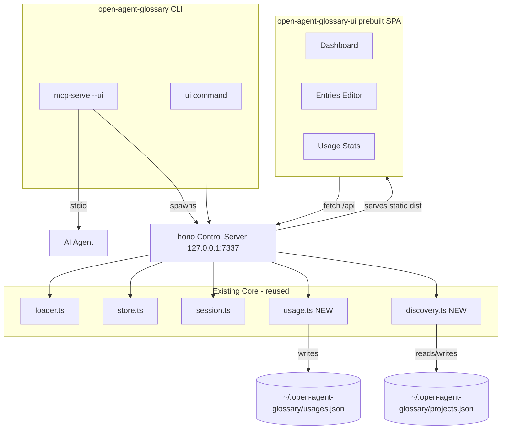

# Implementation Plan: Local Glossary UI + Usage Tracking

> Status: Approved plan, ready for implementation.
> Scope: Add a local web UI (Vite + React + shadcn/ui) backed by a hono control
> server embedded in the core package, plus global usage tracking and
> filesystem discovery of glossaries across the user's machine.

---

## 1. Locked Decisions

| Decision | Choice |
|---|---|
| UI framework | **Vite + React + TypeScript** SPA (not Next.js) |
| Component library | **shadcn/ui** (Vite setup) + Tailwind v4 |
| Charts | shadcn Charts (Recharts wrappers) |
| Data fetching | TanStack Query → hono `/api` |
| Backend / API | **hono** control server, embedded in core package |
| Distribution | Separate prebuilt **`open-agent-glossary-ui`** package, shipped via `optionalDependencies` + lazy `npx` fallback |
| Discovery | Project registry (`~/.open-agent-glossary/projects.json`) — no full disk scan |
| Usage tracking | `~/.open-agent-glossary/usages.json` — per-term / per-session / global totals |
| Session identity | UUID `sessionId` added to `SessionState` |
| Build on user machine | **Never** — UI ships prebuilt; lazy = download, not compile |
| Autostart | Config `ui.autostart` + explicit `ui` command |

---

## 2. Architecture Overview

The core package gains a thin **hono control server** that wraps existing core
functions and exposes them over HTTP on `127.0.0.1`. The UI is a **separate
prebuilt Vite + shadcn SPA** that talks to that server via `fetch`. MCP (stdio,
for the agent) and the control server (HTTP, for the browser) run side by side.



**Key principle:** Vite/React/shadcn are *build-time* concerns. At runtime the
user's machine only runs the hono server serving static files + JSON APIs.
Nothing is compiled on the user's machine.

---

## 3. Global Storage Layout

All per-user global state lives under `~/.open-agent-glossary/`:

```
~/.open-agent-glossary/
  config.json        # existing global config tier
  glossary.json(l)   # existing global glossary tier
  usages.json        # NEW - usage tracking
  projects.json      # NEW - registry of seen project roots
```

Session state stays where it is today (`os.tmpdir()/open-agent-glossary/session.json`).

---

## 4. Phase M1 — Usage Tracking (backend only)

Delivers value with zero UI. Pure core module + wire-in points.

### 4.1 New file: `src/core/usage.ts`

Storage: `~/.open-agent-glossary/usages.json`.

```ts
export interface TermUsage {
  lookups: number;
  injections: number;
  lastUsed: number; // epoch ms
}

export interface SessionUsage {
  sessionId: string;
  cwd: string;
  startedAt: number;
  lastUsed: number;
  lookups: number;
  injections: number;
  byTerm: Record<string, { lookups: number; injections: number }>;
}

export interface UsageStore {
  version: 1;
  totals: {
    lookups: number;
    injections: number;
    byTerm: Record<string, TermUsage>;
  };
  sessions: Record<string, SessionUsage>;
}

// API
export function readUsage(): UsageStore;
export function recordUsage(
  kind: "lookup" | "injection",
  terms: string[],
  sessionId: string,
  cwd: string
): void;
export function getSessionUsage(sessionId: string): SessionUsage | null;
export function getTopTerms(
  limit: number,
  kind?: "lookup" | "injection"
): Array<{ term: string; lookups: number; injections: number }>;
export function resetUsage(): void; // for tests / explicit reset
```

**Implementation notes:**
- Default store created on first write: `{ version: 1, totals: { lookups: 0, injections: 0, byTerm: {} }, sessions: {} }`.
- **Atomic writes**: write to `usages.json.tmp` then `rename()` to avoid
  corruption when MCP and UI write concurrently.
- **Debounced flush**: in-process queue so high-frequency injections don't
  thrash disk. Coalesce writes within a short window (e.g. 250ms).
- Corrupt/unparseable file → start fresh rather than throw.
- Term keys are stored lowercased to match loader/matcher behavior.

### 4.2 Session identity

Add `sessionId` to `SessionState` in `src/core/types.ts`:

```ts
export interface SessionState {
  sessionId: string; // NEW - UUID, stable for the session lifetime
  loadedTerms: string[];
  lastUpdated: number;
  cwd: string;
}
```

In `src/core/session.ts`:
- `freshSession()` generates `sessionId` via `crypto.randomUUID()`.
- Preserve `sessionId` across `markTermsLoaded()` updates.
- A new session (TTL expiry or cwd change) produces a new `sessionId`.

### 4.3 Wire-in points

| Event source | File | Call |
|---|---|---|
| MCP lookup | `src/mcp/tools.ts` → `glossary_lookup` | `recordUsage("lookup", [term], session.sessionId, cwd)` |
| Auto-injection | `src/cli/inject.ts` (after successful inject) | `recordUsage("injection", result.newTerms, session.sessionId, cwd)` |

- MCP tools currently have no session context; load session inside the tool
  handler (`loadSession()`) to obtain `sessionId` + `cwd`.
- Only record injections for `newTerms` (terms actually injected this turn),
  not re-matches that were deduped.

### 4.4 Tests: `test/core/usage.test.ts`

- record lookup/injection increments global + session + per-term.
- per-session isolation (two sessionIds don't bleed).
- `getTopTerms` ordering + limit + kind filter.
- atomic write survives concurrent calls (sequential simulation).
- corrupt file → fresh store.
- `resetUsage` clears everything.

---

## 5. Phase M2 — Discovery + Project Registry

### 5.1 New file: `src/core/discovery.ts`

```ts
export interface DiscoveredFile {
  path: string;
  format: "json" | "jsonl";
  scope: "global" | "project";
  tier: string;       // human label, e.g. "~/.agents/glossary"
  entryCount: number;
  exists: boolean;
}

export interface ProjectGlossaries {
  root: string;
  lastSeen: number;
  files: DiscoveredFile[];
}

export interface DiscoveryResult {
  global: DiscoveredFile[];
  projects: ProjectGlossaries[];
}

export function discoverGlossaries(): DiscoveryResult;
export function registerProject(cwd: string): void; // upsert into projects.json
export function readProjectRegistry(): { projects: Array<{ root: string; lastSeen: number }> };
```

**Behavior:**
- **Global tier**: enumerate the absolute `~/...` glossary base paths from
  `resolveGlossaryPaths` (home portion), report which exist + entry counts via
  `findGlossaryFile` + `parseGlossaryFile`.
- **Per-project**: read `projects.json` registry. For each registered root,
  enumerate its project-tier files (`.pi/`, `.agents/`, `.open-agent-glossary/`).
- `registerProject(cwd)` is called by the control server on startup, so the
  "whole computer" view grows organically as the tool is used in more repos.
- No recursive disk scan. (Optional future `--scan <root>` flag, explicitly
  opt-in, depth-limited — out of scope for this plan.)

### 5.2 Registry storage: `~/.open-agent-glossary/projects.json`

```json
{
  "version": 1,
  "projects": [
    { "root": "/Users/me/Dev/foo", "lastSeen": 1730000000000 }
  ]
}
```

- Dedup by `root`. Update `lastSeen` on each `registerProject`.
- Atomic write like usage store.

### 5.3 Tests: `test/core/discovery.test.ts`

- registry upsert + dedup + lastSeen update.
- global tier enumeration with entry counts (temp HOME).
- project enumeration from registry (temp roots).
- nonexistent files reported with `exists: false` / excluded as appropriate.

---

## 6. Phase M3 — hono Control Server

### 6.1 New file: `src/server/control.ts`

Uses **hono** with the node server adapter (`@hono/node-server`). Binds to
`127.0.0.1` only. Default port `7337`, override via `--port` / `OAG_UI_PORT`.

```ts
export interface ControlServerOptions {
  port?: number;       // default 7337
  cwd?: string;        // project root for project-scoped ops
  serveUi?: boolean;   // serve static UI assets if available
  open?: boolean;      // launch browser
}
export function startControlServer(opts: ControlServerOptions): Promise<{ url: string; close: () => Promise<void> }>;
```

### 6.2 REST API surface

| Method | Route | Backed by |
|---|---|---|
| GET | `/api/health` | static ok + version |
| GET | `/api/discovery` | `discoverGlossaries()` |
| GET | `/api/session` | `loadSession()` (sessionId, loadedTerms, cwd) |
| GET | `/api/entries?scope=merged\|global\|project` | `loadGlossary` / `loadGlossaryByScope` (each entry annotated with source path + scope) |
| POST | `/api/entries` | `addTerm(scope, entry, cwd)` |
| PUT | `/api/entries/:term` | `editTerm(scope, term, updates, cwd)` |
| DELETE | `/api/entries/:term?scope=` | `removeTerm(scope, term, cwd)` |
| GET | `/api/usage` | `readUsage()` totals |
| GET | `/api/usage/session/:id` | `getSessionUsage(id)` |
| GET | `/api/usage/top?limit=&kind=` | `getTopTerms()` |
| GET | `/api/suggest?term=` | smart suggestions (see M5) |

**Cross-cutting:**
- CORS restricted to `http://localhost:*` / `http://127.0.0.1:*`.
- JSON error envelope: `{ error: string }` with appropriate status codes.
- On startup: `registerProject(cwd)`.
- Static serving: if the UI package resolves (see M6), serve its `dist/` at `/`;
  otherwise `/` returns a short "UI not installed" HTML with the install command.

### 6.3 CLI integration

- Extend `mcp-serve`: `open-agent-glossary mcp-serve --ui [--port N] [--open]`
  → starts MCP stdio **and** the control server.
- New standalone command `src/cli/ui.ts`: `open-agent-glossary ui [--port N] [--no-open]`
  → starts only the control server + UI (no agent). Lazily ensures the UI
  package is present (see M6).
- Register both in `src/cli/index.ts` (commander).

### 6.4 New dependencies (core package)

- `hono`
- `@hono/node-server`

### 6.5 Tests: `test/server/control.test.ts`

- each route against temp HOME/cwd, using `app.request()` (hono's built-in test
  client — no network needed).
- entries CRUD round-trip (add → list → edit → delete).
- discovery + usage routes return expected shape.
- error cases (duplicate add, edit missing term) → correct status + envelope.

---

## 7. Phase M4 — UI Scaffold (Vite + React + shadcn)

### 7.1 New package: `ui/` (npm workspace → published as `open-agent-glossary-ui`)

```bash
npm create vite@latest ui -- --template react-ts
cd ui
npm install tailwindcss @tailwindcss/vite
npx shadcn@latest init
npx shadcn@latest add button card table dialog sheet input textarea badge sonner command tabs
```

Stack:
- Vite + React + TypeScript
- Tailwind v4 (`@tailwindcss/vite`)
- shadcn/ui components (copied as source into `ui/src/components/ui/`)
- TanStack Query for data fetching
- Recharts (via shadcn Charts) for usage stats

### 7.2 API base URL

- Dev: Vite proxy `/api` → `http://127.0.0.1:7337`.
- Prod (served by control server): same-origin, no proxy needed.

### 7.3 Pages / routes

1. **`/` Dashboard**
   - `StatCard`s: total glossaries found, total entries, lookups (global +
     session), injections (global + session).
   - "Loaded this session" panel (from `/api/session`).
   - "Glossaries on this computer" — grouped global vs per-project
     (from `/api/discovery`), each showing path, format, entry count.

2. **`/entries` Entries manager**
   - shadcn `Table`: term, definition (truncated), aliases, scope `Badge`,
     source path.
   - Search/filter via `Command` or input.
   - Scope filter tabs: merged / global / project.
   - Row actions: edit (`Dialog`/`Sheet` form → `PUT`), delete (confirm → `DELETE`).
   - "Add entry" button → add form (M5 smart suggestions).

3. **`/usage` Stats**
   - shadcn Chart (bar): top terms by lookups + injections.
   - Toggle: global totals vs current session.
   - Per-term table with last-used + counts.

### 7.4 Components

`StatCard`, `GlossarySourceList`, `EntryTable`, `EntryDialog`, `ScopePicker`,
`UsageChart`, `SessionPanel`.

### 7.5 Build output

- `vite build` → `ui/dist/` (static assets).
- Published package contains **only** `dist/` (+ minimal `package.json`),
  prebuilt. No source build required on the user's machine.

---

## 8. Phase M5 — Smart Suggestions (Add flow)

### 8.1 `GET /api/suggest?term=BFF`

Returns:

```ts
interface SuggestResult {
  scope: "project" | "global";        // recommended target
  targetFile: string;                 // exact file it will write to
  duplicate: null | { term: string; scope: string; path: string };
  aliasCandidates: string[];          // dashed<->spaced, plural/singular, etc.
  patternHint: string | null;         // escaped regex if term has special chars
  formatHint: "json" | "jsonl";       // jsonl for project/shared, json for personal
}
```

**Heuristics:**
- **Scope**: if a `.agents/glossary.*` (or other project tier) exists in the
  active project → suggest `project`; else `global`. Surface the exact write path.
- **Duplicate**: check all tiers; if the term exists, flag which tier/path
  (merge order matters).
- **Aliases**: derive dashed↔spaced variants, simple plural/singular, acronym
  expansion if obvious.
- **Pattern**: if term contains regex-special chars, suggest an escaped `pattern`.
- **Format**: recommend `.jsonl` for shared/project, `.json` for personal global.

### 8.2 UI

Add form renders suggestions as accept/dismiss chips (scope, aliases, format).
Selecting a chip pre-fills the corresponding field before submit.

---

## 9. Phase M6 — Distribution, Autostart, Packaging

### 9.1 Two-package layout

```
open-agent-glossary           # core CLI + hono server (this repo's main package)
open-agent-glossary-ui        # prebuilt Vite + shadcn SPA (dist only)
```

- Core lists `open-agent-glossary-ui` under **`optionalDependencies`** so a
  normal `npm i -g open-agent-glossary` pulls it automatically, but a failure
  (offline) doesn't break core install.
- Control server resolves the UI package at runtime:
  - **resolvable** → serve its `dist/`.
  - **not resolvable** → print install hint; `ui` command offers to
    `npx open-agent-glossary-ui` (download prebuilt, **no build step**).

### 9.2 Config: UI section

Extend the config schema (already supports nested objects):

```json
{
  "ui": {
    "autostart": false,
    "port": 7337,
    "open": true
  }
}
```

- `ui.autostart: true` → MCP server (and Pi extension) boot the control server +
  UI when a session starts.
- Update `GlossaryConfig` type + `DEFAULT_CONFIG` accordingly.

### 9.3 Pi extension hook

- On extension activation, read config; if `ui.autostart` → call
  `startControlServer({ serveUi: true, open: config.ui.open })`.

### 9.4 Scripts (root)

- `dev:ui` → `vite` dev server in `ui/`.
- `build:ui` → `vite build` in `ui/`.
- `build` → core build (unchanged); UI built/published separately.

---

## 10. Phase M7 — Docs + Skill Update

- README: new "Local UI" section (screenshots, `mcp-serve --ui`, `ui` command,
  `ui.autostart` config).
- `skills/open-agent-glossary/SKILL.md`: add UI launch + troubleshooting
  (port in use, UI package missing, autostart config).
- Document `usages.json` / `projects.json` storage locations.

---

## 11. Milestones Summary

| Milestone | Deliverable | Independent value |
|---|---|---|
| **M1** | `usage.ts` + `sessionId` + wire-in + tests | Usage tracked, no UI needed |
| **M2** | `discovery.ts` + project registry + tests | Know what exists where |
| **M3** | hono control server + routes + CLI flags + tests | API reachable (curl-able) |
| **M4** | Vite + shadcn UI scaffold (dashboard + entries CRUD) | Core UI usable |
| **M5** | Usage charts + smart suggestions | Full feature set |
| **M6** | `-ui` package + optionalDependency + autostart config | One-command launch |
| **M7** | README + skill + storage docs | Shippable |

**Build order:** M1 → M2 → M3 (all in core package, fully testable without UI),
then M4 → M5 (UI), then M6 → M7 (packaging + docs).

---

## 12. New Dependencies

| Package | Where | Purpose |
|---|---|---|
| `hono` | core | control server routing |
| `@hono/node-server` | core | node adapter for hono |
| `vite`, `react`, `react-dom` | `ui/` (dev) | SPA |
| `tailwindcss`, `@tailwindcss/vite` | `ui/` (dev) | styling |
| shadcn/ui components | `ui/` (source) | UI primitives |
| `@tanstack/react-query` | `ui/` | data fetching |
| `recharts` | `ui/` | usage charts |

Core runtime deps stay minimal (adds only `hono` + `@hono/node-server`).
UI deps are isolated in the separate package and never enter the core runtime.

---

## 13. Security / Safety Notes

- Control server binds **`127.0.0.1` only** — never `0.0.0.0`.
- CORS limited to localhost origins.
- No disk-wide scanning; discovery is registry-based and bounded.
- Atomic writes for `usages.json` / `projects.json` to survive concurrent
  MCP + UI access.
- Usage data is per-user local only; never transmitted anywhere.

---

## 14. Open Items (non-blocking)

- Optional future `--scan <root>` for bounded filesystem discovery.
- Optional usage event ring-buffer (timeline view) if richer stats are wanted later.
- Optional export/import of glossaries from the UI.
